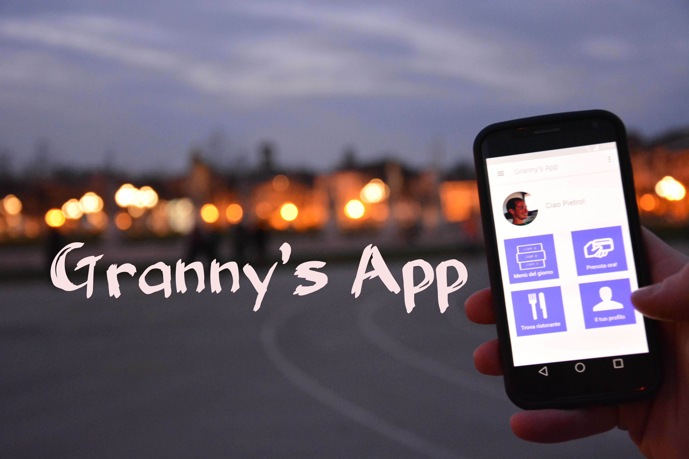
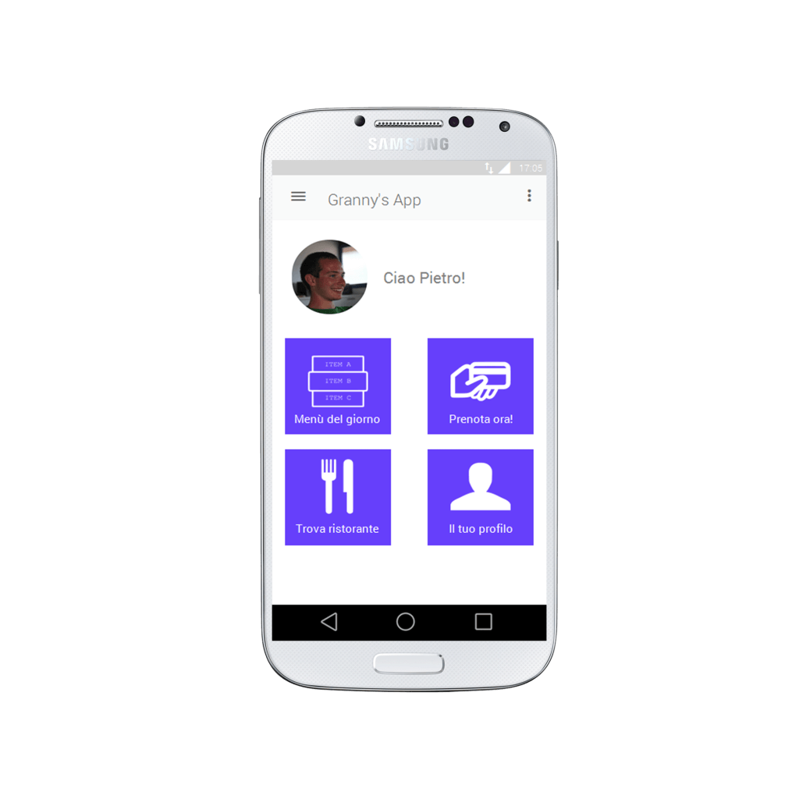

In Gennaio ho partecipato ad un concorso promosso dall'[Expo di Milano](http://www.expo2015.org) agli studenti di scuola superiore.

Il tema riguardava l'alimentazione, ma la cosa più bella è che non avevamo nessuna richiesta specifica su come rappresentare il tutto.

L'unico problema era il tempo, troppo poco! Ho avuto meno di una settimana per progettare tutta la presentazione, fare le riprese e montare l'intero video.

In poche parole il progetto **Granny's App** propone una applicazione per smartphone dove è possibile cercare ricette del territorio veneto, ma anche prenotare un pasto nel ristorante più vicino.

Il tutto è iniziato con un lavoro a gruppi per rielaborare varie ricette locali. Poi, dopo aver deciso il nome del progetto, ognuno si è messo in gioco con le proprie abilità!

La pazzia mi ha portato a realizzare un applicazione prototipo, per rendere il video più realistico, in puro [Material Design](https://en.wikipedia.org/wiki/Material_Design). Nel video potrete vedere la demo in Prato della Valle!

Grazie a tutti!

<iframe title="vimeo-player" src="https://player.vimeo.com/video/118398900?h=0d7f910300" width="640" height="360" frameborder="0"    allowfullscreen></iframe>