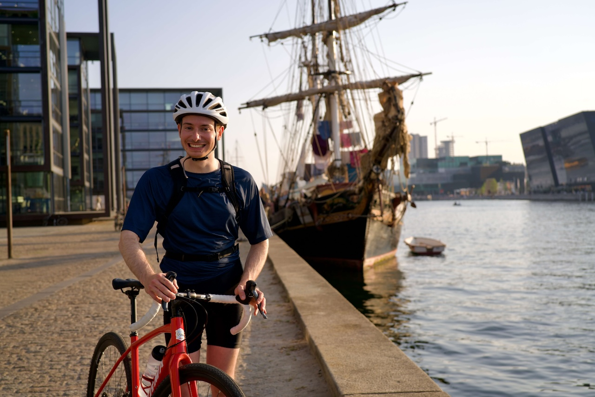

<h2 align="center">Ciao 👋 I'm Pietro!</h2>

I'm from Padova, near Venice, and moved to Denmark for my studies. 
I'm currently working in engineering within the finance industry in Copenhagen.

I'm a Senior Software and Data Engineer at [Nykredit](https://www.nykredit.com) in Wealth & Asset Management. 
I focus on working with data, building resilient integrations with several systems, 
enabling users to consume it, and adopting a cloud-first approach.

I completed a Master of Science in Engineering in Human-Centered AI at the [Technical University of Denmark](https://www.dtu.dk/english) 
and a B.Sc. in Computer Science at [Ca' Foscari University of Venice](https://www.unive.it/pag/13526).

I led a study of Human-Mobility leveraging shared-mobility data. Since May 2019 I've been working on
[Movi](https://www.ridemovi.com/) (formerly Mobike Italy) data for the city of Padova ([more details](/projects)). 
More recently, I have developed [OSM POI](https://github.com/peterampazzo/osm-poi), a Python application to retrieve 
land-use data from OpenStreetMap. In February 2022 for my Master's thesis, I joined [DSB Digital Lab](https://www.dsbdigitallabs.dk/)
(part of the Danish State Railway) to study the users' usage data of [Kørmit](https://www.koermit.dk/). This is a
mobility service, which aims to solve the last-mile problem for commuters to reach their workplace from the closest train station.

Moving to a different country makes you change your habits, and since Denmark is flat, I've had to adapt. 
I've traded mountain hiking in the Dolomites for road cycling and rowing. 
I also enjoy photography and have published some of my work on [Unsplash](https://unsplash.com/@peterampazzo).

You can find me on [Twitter](https://twitter.com/peterampazzo) /
    [GitHub](https://github.com/peterampazzo) /
    [LinkedIn](https://linkedin.com/in/peterampazzo/)
or you can also [email](mailto:pietro@rampazzo.eu) me.
