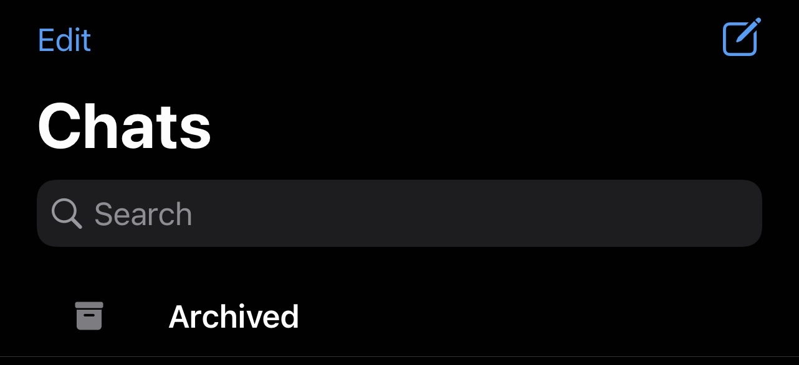

UPDATE (November 13, 2022): Apparently WhatsApp now supports [migrating chats between different OS](https://faq.whatsapp.com/530788665445780/).

--- 

I haven't posted for a very long time, this is the opportunity to give some space 
to some experiments I have done recently 🚀.

Most of the work has already been done and it's open source - this article 
aims to describe what are steps needed to be conducted and which are the limitations.

At the time of writing, WhatsApp doesn't support an official workflow to let users migrate their chats
from an Android device to an iPhone. However, it looks like [this feature is under development](https://faq.whatsapp.com/general/account-and-profile/about-changing-phones/?lang=en).

Worth mentioning, this solution is a bit _hacky_. [Only text messages would be migrated](https://github.com/residentsummer/watoi/issues/1).
This means media (pictures and videos) and audio notes won't be migrated to the new device.
Instead, a placeholder would be display instead such as `<image>` or `<audio>`.

Therefore, it is necessary to have XCode installed. 

1. Run a full backup on the Android device.
1. Activate WhatsApp on the iPhone.
1. Create a backup of WhatsApp on your iPhone.
1. Using [`WhatsApp-Key-DB-Extractor`](https://github.com/KnugiHK/WhatsApp-Key-DB-Extractor) a copy of the backup stored in the Android device can be transferred to the laptop - [download](https://github.com/KnugiHK/WhatsApp-Key-DB-Extractor/archive/refs/heads/master.zip)
the project and extract it, be sure to have all the [prerequisites](https://github.com/KnugiHK/WhatsApp-Key-DB-Extractor#prerequisites) set up.
The device must be connected to the laptop and the debugging mode enabled. 
After exporting the history it might be impossible to launch WhatsApp on your Android device. 
1. (Optional) If you copy on your laptop the WhatsApp media folder you can export into html file all the chats using [`Whatsapp-Chat-Exporter`](https://github.com/KnugiHK/Whatsapp-Chat-Exporter).
1. Clone [`watoi`](https://github.com/residentsummer/watoi) project (or [download](https://github.com/residentsummer/watoi/archive/refs/heads/master.zip)
it as previously done in step 4). Following the [step-by-step guide](https://github.com/residentsummer/watoi#step-by-step-guide) a local backup of the
iPhone will be created (with the new MacOS version must be done using Finder and not iTunes) - therefore, the idea is to inject inside the existing backup the history stored in the backup
created previously on the Android device. Finally, restore the iPhone from the updated backup.

A part of the groups, all the chats will be listed in the 'Archived' tab.
Although, when opening a chat all the saved messages will be displayed!